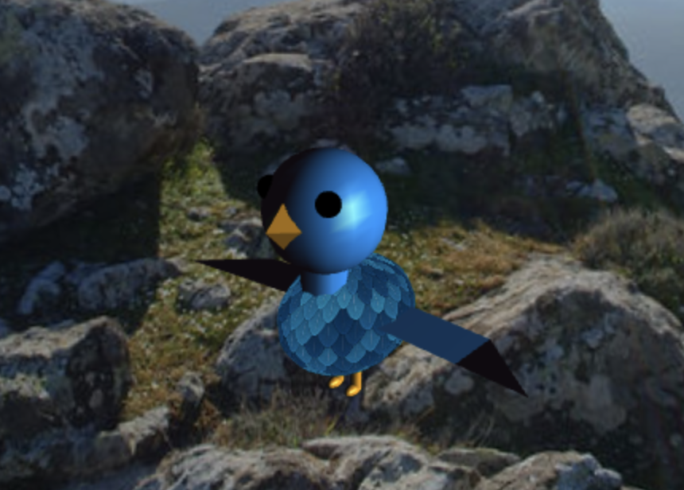

# CG 2022/2023

## Group T03G08
Catarina Barbosa, up202004898
Francisca Andrade, up202005977

## Proj Notes

- In topic 1, we created the sphere with the earth's texture.
- In topic 2, we inverted the faces of the sphere and displayed that with a panoramic texture. We also altered the field of view and centered the panorama.
- In topic 3, we created a bird with some textures, which can move with the keyboard and has animations to oscillate the wings and the own bird
- In topic 4, we added a terrain with some shaders to emulate the colors and height.
- In topic 5, we added a nest and eggs. The bird can move up and down, but we couldn't implement the mechanism of picking and dropping the eggs.
- In topic 6, we added the trees grouped differently, some in a grid of 3x3 and others in a line of six.
- In topic 7, we finally decided to implement the distortion of the trees with the wind through a shader which makes the trees move slightly front to back.

- Topic 2:

- Topic 3: 

- Topic 4: 

-Topic 5:

-Topic 6:

-Topic 7:

