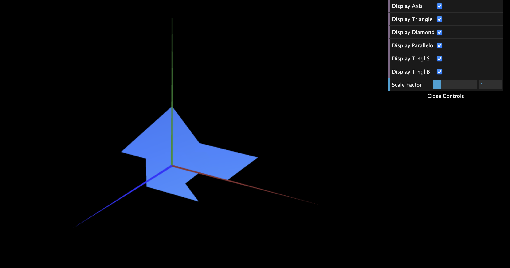

# CG 2022/2023

## Group T03G08

## TP 1 Notes

- In exercise 1, we observed that our objects were being displayed always in green. This was due to our code for the display being before the function *setDefaultAppearence*, so we corrected it. We also had some difficulties having the objects displaying on both sides.
- In exercise 2, we didn't have any difficulties.

