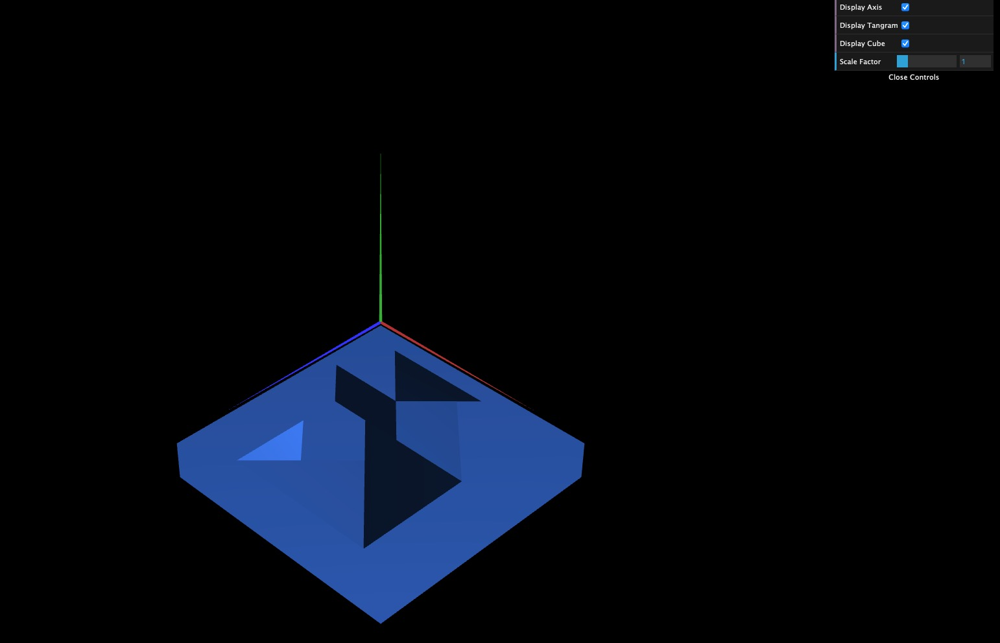
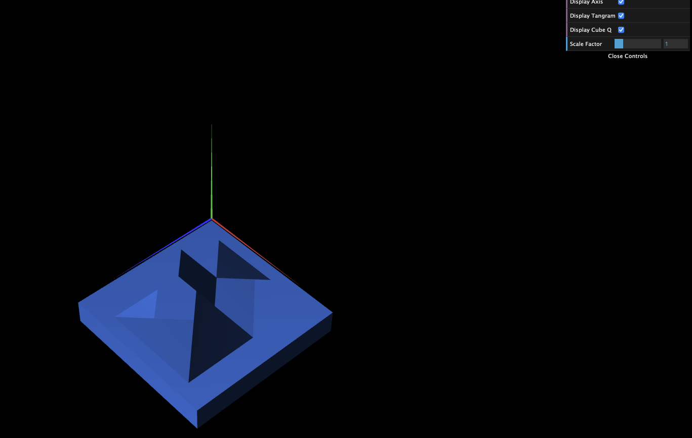

# CG 2022/2023

## Group T03G08

## TP 2 Notes

- In exercise 1, we had some initial trouble understanding how to do the transformations, but after comprehending them we complete the exercise with no major problems.
- In exercise 2, we did this without major complications, we only needed to pay good attention the order of connecting the indices.
- In exercise 3, we had no difficulties while working on it.

- Exercise 1:

- Exercise 2:

- Exercise 3:

