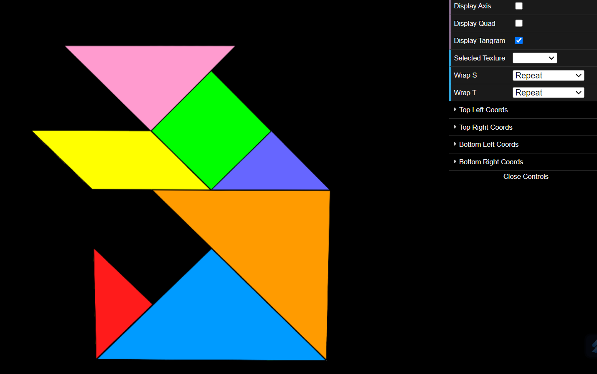
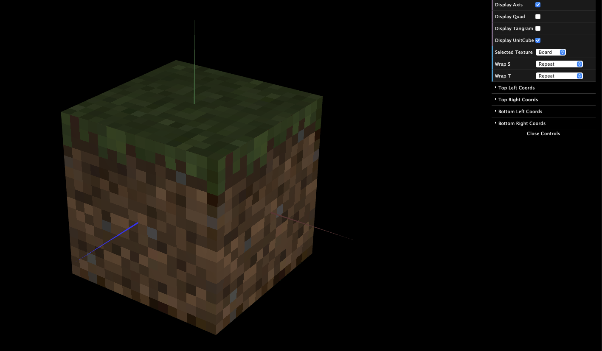

# CG 2022/2023

## Group T03G08

## TP 3 Notes

- In exercise 1, we initially had some trouble understanding what was asked, but after comprehending we completed the exercise with ease.
- In exercise 2, in general it was done with no major issues, except the fact that some faces of the cube were not showing correctly, but it was an easy fix.

- Exercise 1:

- Exercise 2: 

