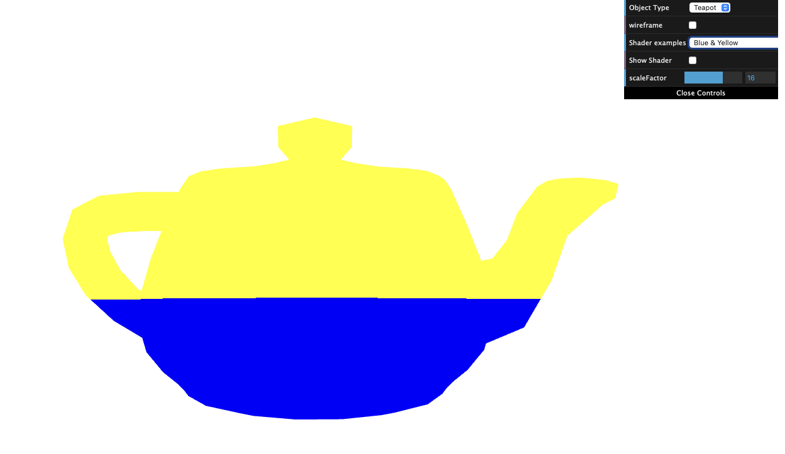
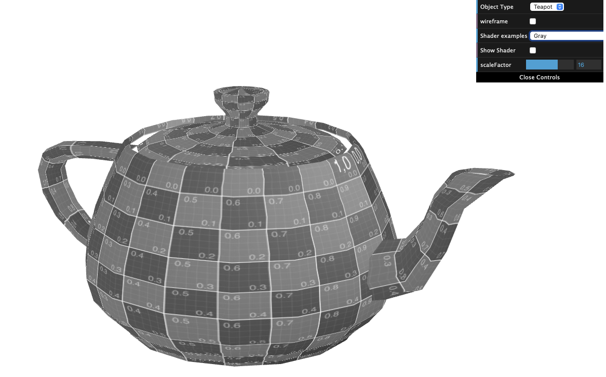
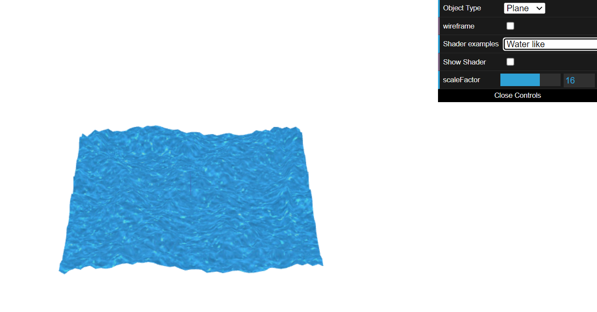

# CG 2022/2023

## Group T03G08

## TP 5 Notes

- In exercise 1, we had no major problems figuring out what to do after analysing and understanding the code given to us.
- In exercise 2, we had some difficulties with the shaders, but after understanding that better we were able to conclude the exercise.

- Exercise 1.1:

- Exercise 1.2: 

- Exercise 2: 

